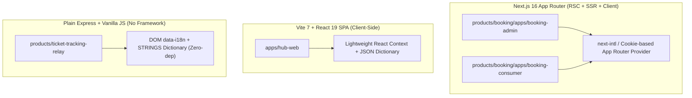
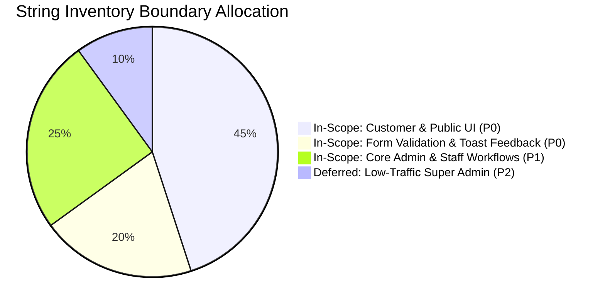
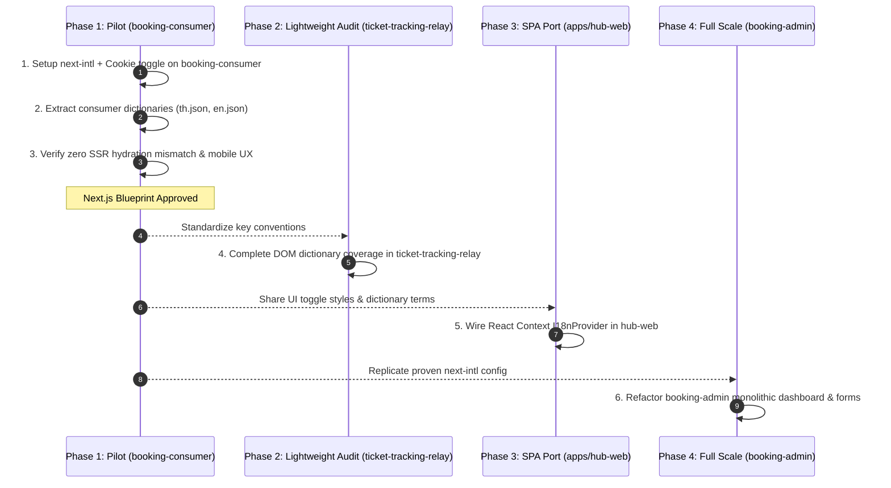

# Bilingual UI (Thai/English) Architecture & Implementation Proposal
**Author:** Antigravity (AGY)  
**Date:** 2026-08-19  
**Status:** Under Review (Proposal Only — Zero Code/Dependency Changes Made)  
**Reference Policy:** [`docs/platform/I18N_POLICY.md`](file:///D:/AI-Workspace/projects/saas-product-hub/docs/platform/I18N_POLICY.md#L1-L52)  
**Target Products:** `products/booking` (`booking-admin`, `booking-consumer`), `apps/hub-web`, `products/ticket-tracking-relay`

---

## Executive Summary & Codebase Ground Truth

Following the standing Bilingual UI policy ([`docs/platform/I18N_POLICY.md:1-52`](file:///D:/AI-Workspace/projects/saas-product-hub/docs/platform/I18N_POLICY.md#L1-L52)), an in-depth survey of the active user-facing applications across `saas-product-hub` was conducted.

### Discovered Stack Matrix & Current Baseline

| Target App | Real Stack Discovered | Current Language State | Evidence Citations |
|---|---|---|---|
| **`products/booking/apps/booking-consumer`** | **Next.js 16.3.0 + React 19.2.8** (App Router, Server + Client Components) | Hardcoded Thai text; HTML root hardcoded `lang="en"`. No i18n mechanism. | [`package.json:16-19`](file:///D:/AI-Workspace/projects/saas-product-hub/products/booking/apps/booking-consumer/package.json#L16-L19)<br>[`src/app/layout.tsx:22-24`](file:///D:/AI-Workspace/projects/saas-product-hub/products/booking/apps/booking-consumer/src/app/layout.tsx#L22-L24)<br>[`src/app/book/[slug]/page.tsx:1-721`](file:///D:/AI-Workspace/projects/saas-product-hub/products/booking/apps/booking-consumer/src/app/book/%5Bslug%5D/page.tsx#L1-L721) |
| **`products/booking/apps/booking-admin`** | **Next.js 16.3.0 + React 19.2.8** (App Router, Server Actions, Server + Client Components) | Hardcoded Thai text across dashboard, settings, auth, and tickets. Root hardcoded `lang="en"`. | [`package.json:16-19`](file:///D:/AI-Workspace/projects/saas-product-hub/products/booking/apps/booking-admin/package.json#L16-L19)<br>[`src/app/layout.tsx:22-24`](file:///D:/AI-Workspace/projects/saas-product-hub/products/booking/apps/booking-admin/src/app/layout.tsx#L22-L24)<br>[`src/app/dashboard/page.tsx:40,55-60`](file:///D:/AI-Workspace/projects/saas-product-hub/products/booking/apps/booking-admin/src/app/dashboard/page.tsx#L40) |
| **`apps/hub-web`** | **Vite 7.1.7 + React 19.2.1 + wouter 3.3.5 + Express 4.21.2** *(Note: SPA/Client-side router, NOT Next.js)* | Has initial bespoke `lang` state (`localStorage.getItem('hub_lang')`) & toggle button in Navbar; inline ternary strings in `HubHome.tsx`. | [`package.json:8,62,74,96`](file:///D:/AI-Workspace/projects/saas-product-hub/apps/hub-web/package.json#L8)<br>[`client/src/App.tsx:14-25,31-36`](file:///D:/AI-Workspace/projects/saas-product-hub/apps/hub-web/client/src/App.tsx#L14-L25)<br>[`client/src/components/HubNavbar.tsx:82-90`](file:///D:/AI-Workspace/projects/saas-product-hub/apps/hub-web/client/src/components/HubNavbar.tsx#L82-L90)<br>[`client/src/pages/HubHome.tsx:148-190`](file:///D:/AI-Workspace/projects/saas-product-hub/apps/hub-web/client/src/pages/HubHome.tsx#L148-L190) |
| **`products/ticket-tracking-relay`** | **Plain Express 4.22.2 + Vanilla JS** (No bundler, no framework) | Working baseline i18n already implemented via DOM attributes `data-i18n` and dictionary object. | [`package.json:10-12`](file:///D:/AI-Workspace/projects/saas-product-hub/products/ticket-tracking-relay/package.json#L10-L12)<br>[`public/index.html:13-17`](file:///D:/AI-Workspace/projects/saas-product-hub/products/ticket-tracking-relay/public/index.html#L13-L17)<br>[`public/app.js:10-106`](file:///D:/AI-Workspace/projects/saas-product-hub/products/ticket-tracking-relay/public/app.js#L10-L106) |

---

## 1. Per-Stack Approach

We have two distinct architectural archetypes in the portfolio:
1. **React-based applications:** Next.js 16 App Router (`booking-admin`, `booking-consumer`) and Vite + React 19 SPA (`hub-web`).
2. **Vanilla JS application:** `ticket-tracking-relay`.



### 1.1. Next.js 16 Apps (`booking-admin`, `booking-consumer`)
- **Recommended Library:** `next-intl` (App Router without URL locale prefixes / Cookie-driven).
- **Why `next-intl` over hand-rolled context:**
  - **Server Components (RSC) Support:** `booking-admin` and `booking-consumer` use Next.js 16 Server Components in layouts and actions (e.g. [`booking-admin/src/app/dashboard/layout.tsx:5-38`](file:///D:/AI-Workspace/projects/saas-product-hub/products/booking/apps/booking-admin/src/app/dashboard/layout.tsx#L5-L38)). A pure React Context (`React.createContext`) fails on Server Components because Context only exists on the client. `next-intl` provides `getTranslations()` for Server Components and `useTranslations()` for Client Components seamlessly.
  - **Zero Flash of Untranslated Content (FOUC):** Next.js reads the locale cookie during SSR in `src/app/layout.tsx`, ensuring the server renders the correct language in the initial HTML markup.
  - **Type Safety & Autocomplete:** Compiles dictionary keys (`messages/th.json`, `messages/en.json`) into TypeScript definitions, preventing missing translation runtime errors.
  - **Lightweight Bundle:** `next-intl` tree-shakes unused formatters; dictionary messages are split per page/app without bundling entire JSON files into the client JS unless requested.

### 1.2. Vite + React 19 SPA (`apps/hub-web`)
- **Architectural Discovery:** `apps/hub-web` uses Vite + `wouter` ([`apps/hub-web/package.json:74,96`](file:///D:/AI-Workspace/projects/saas-product-hub/apps/hub-web/package.json#L74)), not Next.js.
- **Recommended Approach:** Lightweight `I18nProvider` (React Context + typed JSON dictionaries `locales/th.json` & `locales/en.json`).
- **Rationale:**
  - `hub-web` is 100% client-rendered via `createRoot` ([`apps/hub-web/client/src/main.tsx:32-38`](file:///D:/AI-Workspace/projects/saas-product-hub/apps/hub-web/client/src/main.tsx#L32-L38)).
  - It already possesses a rudimentary `lang` state in [`App.tsx:14-25`](file:///D:/AI-Workspace/projects/saas-product-hub/apps/hub-web/client/src/App.tsx#L14-L25) and a `<Globe />` toggle in [`HubNavbar.tsx:82-90`](file:///D:/AI-Workspace/projects/saas-product-hub/apps/hub-web/client/src/components/HubNavbar.tsx#L82-L90).
  - Replacing inline ternary operators (`lang === 'th' ? ... : ...` in [`HubHome.tsx:148-190`](file:///D:/AI-Workspace/projects/saas-product-hub/apps/hub-web/client/src/pages/HubHome.tsx#L148-L190)) with a clean `useI18n()` hook and structured JSON dictionaries avoids bringing heavy dependencies while keeping dictionary keys structured consistently with the Next.js apps.

### 1.3. Plain Vanilla-JS App (`products/ticket-tracking-relay`)
- **Recommended Approach:** Retain and finalize the lightweight, zero-dependency DOM translation pattern already established in [`products/ticket-tracking-relay/public/app.js:10-106`](file:///D:/AI-Workspace/projects/saas-product-hub/products/ticket-tracking-relay/public/app.js#L10-L106).
- **Rationale:**
  - No bundler (Webpack/Vite) or React exists in this product ([`products/ticket-tracking-relay/package.json:10-12`](file:///D:/AI-Workspace/projects/saas-product-hub/products/ticket-tracking-relay/package.json#L10-L12)).
  - Forcing `i18next` or a build toolchain would add needless bloat and complexity.
  - The existing pattern uses `data-i18n="key"` and `data-i18n-placeholder="key"` with an in-memory `STRINGS` dictionary and a client-side toggle:
    ```js
    function applyLocale() {
      document.documentElement.lang = locale;
      $$("[data-i18n]").forEach(el => { el.textContent = t(el.dataset.i18n); });
      $$("[data-i18n-placeholder]").forEach(el => { el.placeholder = t(el.dataset.i18nPlaceholder); });
      $("#lang-toggle").textContent = locale === "th" ? "EN" : "ไทย";
    }
    ```
  - **Verdict:** Keep this exact pattern for `ticket-tracking-relay`. The only remaining task is ensuring complete dictionary coverage for all labels, modals, and error states.

---

## 2. The Toggle Mechanism, Placement & Persistence

### 2.1. Toggle Button UI Placement

| Application | Exact Placement in Layout | Visual Style & Behavior |
|---|---|---|
| **`apps/hub-web`** | [`apps/hub-web/client/src/components/HubNavbar.tsx:82-90`](file:///D:/AI-Workspace/projects/saas-product-hub/apps/hub-web/client/src/components/HubNavbar.tsx#L82-L90) | **Already exists:** `<Globe className="w-3.5 h-3.5 mr-1.5" />` button displaying `EN` (when Thai is active) and `TH` (when English is active). |
| **`booking-consumer`** | Top-right header on `/` ([`src/app/page.tsx:1-47`](file:///D:/AI-Workspace/projects/saas-product-hub/products/booking/apps/booking-consumer/src/app/page.tsx#L1-L47)) and fixed/sticky top pill on `/book/[slug]` ([`src/app/book/[slug]/page.tsx:1-60`](file:///D:/AI-Workspace/projects/saas-product-hub/products/booking/apps/booking-consumer/src/app/book/%5Bslug%5D/page.tsx#L1-L60)). | Minimalist pill button with globe icon (`🌐 EN` / `🌐 TH`), high z-index, seamlessly fitting mobile viewports. |
| **`booking-admin`** | **Unauthenticated pages** ([`src/app/login/page.tsx`](file:///D:/AI-Workspace/projects/saas-product-hub/products/booking/apps/booking-admin/src/app/login/page.tsx), [`src/app/register/page.tsx`](file:///D:/AI-Workspace/projects/saas-product-hub/products/booking/apps/booking-admin/src/app/register/page.tsx)): Fixed top-right utility bar.<br>**Dashboard:** [`src/app/dashboard/layout.tsx:30-34`](file:///D:/AI-Workspace/projects/saas-product-hub/products/booking/apps/booking-admin/src/app/dashboard/layout.tsx#L30-L34) right next to the "ออกจากระบบ" (Sign Out) button. | Compact segmented switch or button matching the dark slate theme (`border-slate-700 bg-slate-900 text-slate-300`). |
| **`ticket-tracking-relay`** | [`products/ticket-tracking-relay/public/index.html:17`](file:///D:/AI-Workspace/projects/saas-product-hub/products/ticket-tracking-relay/public/index.html#L17) | **Already placed in `.topbar`**: `#lang-toggle` styled button switching between `EN` and `ไทย`. |

### 2.2. Persistence Strategy: Cookie vs. LocalStorage vs. URL Parameter

| Persistence Method | Pros | Cons | Recommendation |
|---|---|---|---|
| **Cookie (`NEXT_LOCALE` / `saas_locale`)** | • Readable by Next.js Server Components & Middleware on the initial HTTP request.<br>• Eliminates SSR hydration mismatches.<br>• Persists across subpaths and sessions. | • Requires standard cookie-handling helper (document.cookie or js-cookie). | **Primary Standard for Next.js apps (`booking-admin`, `booking-consumer`).** |
| **LocalStorage (`saas_locale`)** | • Pure client-side simplicity.<br>• Zero server overhead. | • Invisible to SSR/RSC — causes layout shift / FOUC if used alone on Next.js. | **Primary for `hub-web` (SPA) & `ticket-tracking-relay` (Vanilla JS); secondary sync for Next.js.** |
| **URL Sub-path (`/en/...`, `/th/...`)** | • SEO-friendly for public marketing portals.<br>• Shareable direct links. | • Requires route restructuring and middleware rewrites across all existing route handlers. | **Not recommended for initial phase** (unnecessary complexity for authenticated dashboards and booking wizards). |

### 2.3. Default Locale
- **Default:** **Thai (`th`)**
- **Fallback Rule:** If no cookie/localStorage is found, default to `th`. The user's explicit selection via the toggle immediately sets both the cookie and `localStorage` to preserve their preference across subsequent sessions.

---

## 3. String Inventory Scope & Boundaries

To ensure clear engineering boundaries, avoid scope creep, and focus on high-impact customer touchpoints, we categorize string domains as follows:



### 3.1. Detailed Scope Matrix & Justifications

| UI Surface / String Category | Scope Status | Priority | Justification & Technical Boundary |
|---|:---:|:---:|---|
| **Customer Booking UI & Steps**<br>(`booking-consumer`, `/book/[slug]`) | **IN SCOPE** | **P0 (Critical)** | Directly customer-facing. Non-Thai customers booking services (e.g. barbershops, car care, clinics) require full English navigation. |
| **Storefront & Catalog**<br>(`apps/hub-web`, `HubHome.tsx`) | **IN SCOPE** | **P0 (Critical)** | SaaS showcase and commercial storefront. International prospects browse product listings and pricing. |
| **Ticket Reporting & Tracking**<br>(`ticket-tracking-relay`, submit/track) | **IN SCOPE** | **P0 (Critical)** | End users submitting bug claims or tracking ticket progress must understand prompts and status badges. |
| **Form Validation Errors & Alerts**<br>(Phone regex, required fields, date limits) | **IN SCOPE** | **P0 (Critical)** | **Crucial:** Having an English form with a Thai-only error popup (e.g. *"กรุณากรอกเบอร์โทรศัพท์"*) breaks the user experience completely. Error helpers must return localized error messages. |
| **Toasts & Feedback Notifications**<br>(Sonner toasts, copy ID confirmations) | **IN SCOPE** | **P0 (Critical)** | Real-time feedback (e.g. *"คัดลอกสำเร็จ"* → *"Copied to clipboard"*) is essential for usability. |
| **Customer Notification Templates**<br>(LINE Flex Cards, Customer Email receipts) | **IN SCOPE (Tiered)** | **P1 (High)** | Customer-facing LINE Flex cards ([`booking-consumer/src/lib/line-flex-templates.ts:1-204`](file:///D:/AI-Workspace/projects/saas-product-hub/products/booking/apps/booking-consumer/src/lib/line-flex-templates.ts#L1-L204)) should support English layout variant based on customer's booking locale preference. |
| **Shop Owner Dashboard & Auth**<br>(`booking-admin` login, register, daily board) | **IN SCOPE** | **P1 (High)** | While shop staff are primarily Thai-speaking today, modern salon/clinic owners and franchise managers frequently operate in English. Authentication pages (`/login`, `/register`) are also entry gates. |
| **Super Admin Platform Console**<br>(`booking-admin/src/app/platform-admin`) | **DEFERRED** | **P2 (Low)** | Internal multi-tenant management used only by internal operators ([`platform-admin/page.tsx:1-357`](file:///D:/AI-Workspace/projects/saas-product-hub/products/booking/apps/booking-admin/src/app/platform-admin/page.tsx#L1-L357)). Can remain Thai/English mixed initially. |
| **Internal Logs, DB Enums & Code Comments** | **OUT OF SCOPE** | **N/A** | Technical identifiers (e.g. DB status `'pending'`, `'confirmed'`, API error codes, commit logs) must remain raw technical identifiers to prevent breaking data layers. |

---

## 4. Pros & Cons Evaluation for Top-Level Next.js Library Choice

In accordance with repo standards ([`products/booking/CLAUDE.md:18`](file:///D:/AI-Workspace/projects/saas-product-hub/products/booking/CLAUDE.md#L18)), all technical options must be evaluated with explicit pros and cons:

| Option | Pros | Cons & Risks | Recommendation Score |
|---|---|---|:---:|
| **Option 1: `next-intl`**<br>*(Modern Next.js 15/16 App Router Standard)* | • **First-class RSC support:** Native `getTranslations()` on server and `useTranslations()` on client without client-boundary hacks.<br>• **Cookie-first routing:** Supports single-button toggle with zero required path prefixes (`/th`, `/en`).<br>• **Type Safety:** Automated key autocompletion in TypeScript.<br>• **Rich ICU formatting:** Handles numbers, currencies, dates (`Intl.DateTimeFormat`), and plurals cleanly.<br>• **Lightweight footprint:** ~3.2 kB gzipped client runtime. | • Adds 1 direct npm dependency (`next-intl`) to `booking-admin` and `booking-consumer`.<br>• Requires setting up request config (`i18n/request.ts`). | **9.5 / 10**<br>*(Recommended for Next.js apps)* |
| **Option 2: Hand-Rolled React Context + JSON Dictionary**<br>*(Custom Provider + `useTranslation` hook)* | • Zero external npm dependencies.<br>• 100% control over implementation details.<br>• Easy to understand and customize. | • **Fails on Server Components:** React Context cannot be accessed in RSC (`async layout.tsx` or server actions); requires wrapping components with `'use client'` or building custom server-side header readers.<br>• No built-in ICU pluralization or dynamic parameter replacement without writing custom regex parser.<br>• Higher maintenance burden over time. | **6.0 / 10**<br>*(Good for Vite SPA `hub-web`, poor for Next.js RSC)* |
| **Option 3: `react-i18next` + `i18next`**<br>*(Traditional React standard)* | • Mature, battle-tested ecosystem.<br>• Huge community and plugins. | • Designed primarily for Client-Side SPAs; complex App Router integration requiring separate server/client wrappers (`i18next-resources-to-backend`).<br>• Larger client bundle size (~12 kB+ gzipped).<br>• Prone to SSR hydration mismatch without extensive boilerplate. | **5.5 / 10** |
| **Option 4: `LinguiJS`**<br>*(Compile-time message extraction)* | • Ultra-compact runtime.<br>• Powerful macro-based message extraction. | • Requires Babel/SWC compile-time plugin configuration.<br>• High setup friction with Next.js 16 compiler configuration.<br>• Overkill for simple two-language dictionary models. | **5.0 / 10** |

---

## 5. Rollout Sequencing & Effort Estimation

### 5.1. Strategy: "Pilot Once → Validate → Scale Across Portfolio"

We recommend a **Pilot-First Sequence** rather than attempting a simultaneous multi-app refactor:



### 5.2. Detailed Phased Plan & Effort Sizing

| Phase & Target | Sizing | Scope & Key Deliverables |
|---|:---:|---|
| **Phase 1: Pilot (`booking-consumer`)** | **Medium** | • Install & configure `next-intl` (request config, cookie reader in root layout).<br>• Create `messages/th.json` & `messages/en.json` (covers landing `/` and booking wizard `/book/[slug]`).<br>• Add localized form validation messages (name, phone, slip upload).<br>• Add toggle component in topbar.<br>• Validate zero hydration errors and clean English customer journey. |
| **Phase 2: Quick Win (`ticket-tracking-relay`)** | **Small** | • Audit existing `STRINGS` object in [`public/app.js:11-80`](file:///D:/AI-Workspace/projects/saas-product-hub/products/ticket-tracking-relay/public/app.js#L11-L80).<br>• Ensure all dynamic modal states, error callouts, and table headers have full English and Thai counterparts.<br>• Zero new npm packages needed. |
| **Phase 3: Storefront (`apps/hub-web`)** | **Medium** | • Create `src/contexts/I18nContext.tsx` with `useI18n()` hook.<br>• Extract static text from [`HubHome.tsx`](file:///D:/AI-Workspace/projects/saas-product-hub/apps/hub-web/client/src/pages/HubHome.tsx) and [`productCatalog.ts`](file:///D:/AI-Workspace/projects/saas-product-hub/apps/hub-web/client/src/productCatalog.ts) into structured JSON files.<br>• Wire existing `<Globe />` toggle in [`HubNavbar.tsx`](file:///D:/AI-Workspace/projects/saas-product-hub/apps/hub-web/client/src/components/HubNavbar.tsx) to update `I18nContext`. |
| **Phase 4: Admin Suite (`booking-admin`)** | **Large** | • Replicate `next-intl` infrastructure from Phase 1.<br>• Extract dictionary strings for auth pages (`login`, `register`, `forgot-password`).<br>• Refactor large dashboard views ([`dashboard/page.tsx`](file:///D:/AI-Workspace/projects/saas-product-hub/products/booking/apps/booking-admin/src/app/dashboard/page.tsx), [`tickets/page.tsx`](file:///D:/AI-Workspace/projects/saas-product-hub/products/booking/apps/booking-admin/src/app/dashboard/tickets/page.tsx)).<br>• Implement localized date/time formatting (`th-TH` vs `en-US`). |

---

## 6. Proposed Dictionary Schema Standard (Example)

To maintain uniformity across apps, all JSON dictionaries should adhere to structured nested domain keys:

```json
{
  "common": {
    "toggleLanguage": "English",
    "save": "บันทึก",
    "cancel": "ยกเลิก",
    "loading": "กำลังโหลด...",
    "search": "ค้นหา..."
  },
  "auth": {
    "loginTitle": "เข้าสู่ระบบ",
    "loginSubtitle": "สำหรับเจ้าของร้านค้าและผู้ดูแลระบบ",
    "emailLabel": "อีเมล",
    "passwordLabel": "รหัสผ่าน",
    "loginButton": "เข้าสู่ระบบ",
    "invalidCredentials": "อีเมลหรือรหัสผ่านไม่ถูกต้อง"
  },
  "booking": {
    "selectService": "เลือกบริการ",
    "selectStaff": "เลือกช่างผู้ให้บริการ",
    "selectDateTime": "เลือกวันและเวลา",
    "customerInfo": "ข้อมูลผู้จอง",
    "depositPromptpay": "ชำระเงินมัดจำผ่าน PromptPay QR",
    "confirmButton": "ยืนยันการจองคิว",
    "errors": {
      "phoneRequired": "กรุณาระบุหมายเลขโทรศัพท์ให้ถูกต้อง",
      "slipRequired": "กรุณาแนบสลิปหลักฐานการโอนเงิน"
    }
  }
}
```

---

## 7. Next Steps & Review Checkpoint

1. **Owner / Claude Review:** Review the proposed per-stack approach (`next-intl` for Next.js, React Context for `hub-web`, vanilla DOM for `ticket-tracking-relay`), toggle persistence, and scope boundaries.
2. **Approval Gate:** Once approved in writing by the owner/Claude, execution will proceed starting with **Phase 1 Pilot on `booking-consumer`**.
