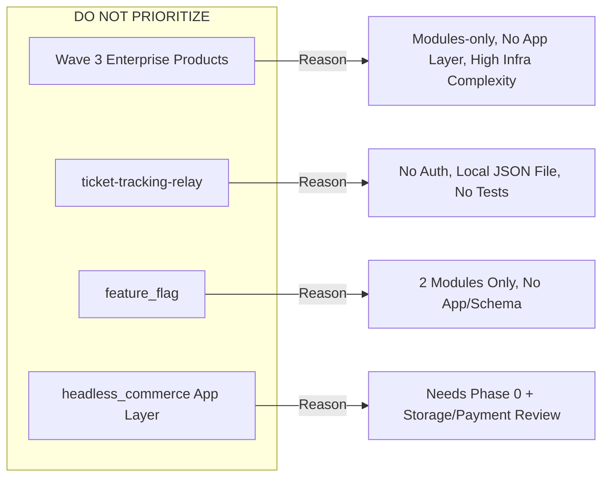
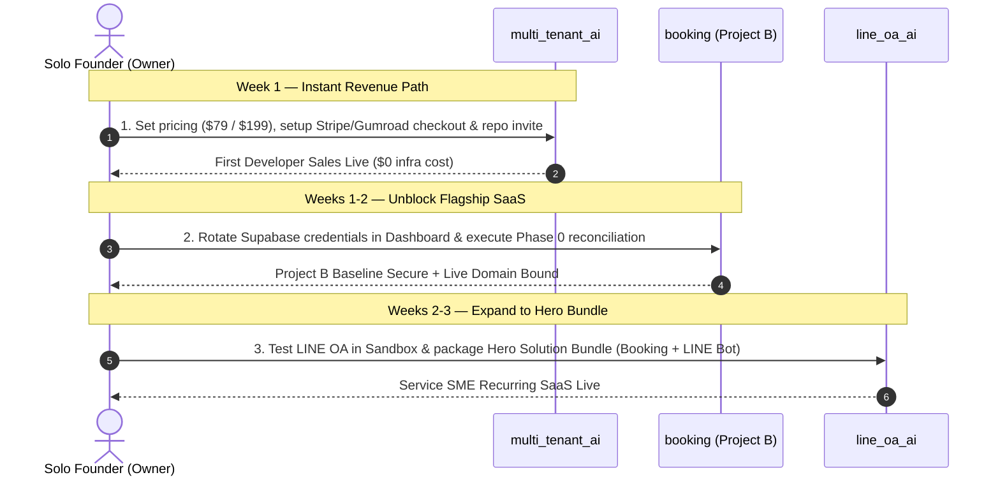

# Revenue Strategy & Monetization Plan — SaaS Product Hub

**Document Status:** Working draft, not an approved pricing document — see correction below
**Baseline Date:** 2026-08-18 (pricing correction applied 2026-08-19)
**Context:** Zero current revenue (pre-launch portfolio). Priority is establishing the fastest, most reliable path to the first paying customer without violating verified engineering realities or mandatory technical gates.  
**Sources of Truth:**
- [`docs/products/registry.yaml`](file:///D:/AI-Workspace/projects/saas-product-hub/docs/products/registry.yaml) (Product Catalog & Target Configurations)
- [`docs/platform/ROADMAP.md`](file:///D:/AI-Workspace/projects/saas-product-hub/docs/platform/ROADMAP.md) (Verified Current Engineering State & Routing Decisions)
- [`docs/platform/DEEP-VERIFICATION-2026-08-18-CONSOLIDATED.md`](file:///D:/AI-Workspace/projects/saas-product-hub/docs/platform/DEEP-VERIFICATION-2026-08-18-CONSOLIDATED.md) (code-level readiness evidence)

**2026-08-19 correction:** this draft originally proposed `booking` pricing tiers that conflict
with the already owner-approved `products/booking/docs/business/PRICING_SPEC.md` (Basic ฿490/mo,
Pro ฿990/mo — no ฿1,290 or ฿2,490 tier exists there). Fixed in §2 below. `line_oa_ai`,
`multi_tenant_ai`, and `headless_commerce` still have **no owner-approved pricing at all** — every
number for those three in this document remains a proposal only, not a decision. None of the four
near-term products are code-ready for real revenue yet either; see the deep-verification doc
above before acting on any of this.

---

## 1. Fastest Path to First Revenue

To achieve first revenue quickly as a solo-founder portfolio, products must be evaluated on **actual operational readiness** rather than aspirational catalog status. Based on verified engineering state on 2026-08-18, the portfolio splits into two distinct monetization paths:

```mermaid
graph TD
    A[Portfolio Monetization Strategy] --> B[Path 1: Instant Zero-Infra Revenue]
    A --> C[Path 2: Flagship Hosted SaaS Revenue]
    
    B --> B1[multi_tenant_ai Starter Kit]
    B1 --> B2[Status: Reference server built, 9/9 tests pass]
    B2 --> B3[Delivery: One-Time License / Source Code]
    B3 --> B4[Effort: 1-2 Days | NO Infra Blockers]
    
    C --> C1[booking: Local Service Booking]
    C1 --> C2[Status: 25 migrations, Stripe/auth mature]
    C2 --> C3[BLOCKED by Mandatory Gates: Credential Rotation + Phase 0]
    C3 --> C4[Unblocking: Owner rotates keys + runs Phase 0]
    C4 --> C5[Effort: 1-2 Weeks | Flagship SaaS Launch]
```

### Path 1 (Fastest / Zero-Infrastructure): `multi_tenant_ai` (Multi-Tenant AI Starter Kit)
- **Deployment Model:** `source_product` (External / Self-hosted).
- **Verified Current State:** Reference server completed on 2026-08-18 at `products/multi-tenant-ai/server/` wiring all 6 modules (`tenant-context`, `ai-provider`, `enterprise-features`, `auth-supabase`, `payment`, `subscription`). Typecheck is clean, 9/9 tests pass. Subscription idempotency and real HMAC-SHA256 Stripe webhook signature verification are built in and verified.
- **Why It Is Fastest:** Sold as a downloadable codebase / developer boilerplate. It requires **no multi-tenant hosting, no custom domain, no production database management, and zero ongoing server operational costs**. Crucially, it is **completely unblocked by Project B's mandatory gates**.
- **Exact Remaining Gap:** As cited in `ROADMAP.md`, this is *"example/reference code for the starter-kit buyer, not a hosted app"*. The remaining gap is strictly commercial and packaging:
  1. Setting up sales & checkout mechanism (e.g. Gumroad, Lemon Squeezy, or Stripe payment link).
  2. Packaging repository access (GitHub collaborator invite or release `.zip`).
  3. Finalizing buyer setup documentation (referencing `products/multi-tenant-ai/BRIEF.md`).
- **Effort Estimate:** **1–2 days** (Commercial packaging & distribution setup).

---

### Path 2 (Flagship Hosted SaaS): `booking` (Local Service Booking)
- **Deployment Model:** `shared_runtime` (Project B).
- **Verified Current State:** The most mature codebase in the portfolio (25 migrations, real Stripe billing, tenant isolation, hold-gating, staff scheduling, customer booking portal).
- **Mandatory Gates & Blockers (Citing `ROADMAP.md` §0 & §A1):**
  > [!WARNING]
  > `booking` CANNOT take live paying customers today due to two mandatory platform gates and missing operational infrastructure:
  > 1. **Gate 1 (Credential Rotation):** Must rotate exposed Supabase service-role/API credentials for projects `gyleqrjdzwwlqierdwcy` and `coyelzlgukvpgguqpjdi` in the Supabase Dashboard. Public production deployment is blocked until this is done.
  > 2. **Gate 2 (Project B Phase 0):** Must complete `docs/platform/SHARED_SAAS_RUNTIME_PROJECT_B_PLAN.md` Phase 0 (reconciliation of migration-history drift, E3.3 live RLS/security verification, disposition of booking's outstanding work, and a reviewed baseline commit).
  > 3. **Operational Gaps:** Requires a production custom domain (Phase 2 Hub CTA handoff is currently blocked on this) and live production Stripe configuration.
- **Exact Gap to Close:** *"requires Phase 0 baseline/security evidence plus live Stripe configuration and a production domain."*
- **Effort Estimate:** **Medium, mostly non-code** (1–2 weeks of owner dashboard actions, migration verification, and domain setup).

---

### Secondary Fast Asset: `booking_ticket_module`
- **Deployment Model:** `source_product` (External / Self-hosted).
- **Verified Current State:** 61/61 tests pass, E2E configured.
- **Exact Gap to Close:** *"Needs a real backend adapter (currently localStorage-only by design) before it is more than a demo template."*
- **Commercial Opportunity:** Can immediately be packaged as a standalone React UI component/template for developers ($39–$59) or upgraded with a lightweight backend adapter for client deployment.
- **Effort Estimate:** **Small–medium** (2–4 days).

---

## 2. Pricing & Packaging Options per Product

*Note: The following section provides a menu of concrete options tailored to each product's target audience and registry metadata. Final packaging decisions remain strictly with the owner.*

### Summary Comparison Table

| Product | Target Audience | Primary Recommended Model | Price Point (Indicative) |
|---|---|---|---|
| **`multi_tenant_ai`** | SaaS Builders, Tech SMEs, AI Indie Hackers | One-Time Developer License | $79 Standard / $199 Extended |
| **`booking`** | Service SMEs (Auto repair, Salons, Clinics) | Tiered Monthly/Annual SaaS | ฿490 – ฿990 / month (owner-approved `PRICING_SPEC.md`; see correction in §2) |
| **`line_oa_ai`** | Service SMEs, Online Shops, Clinics on LINE | Message Volume SaaS / Hero Bundle | ฿590 – ฿2,990 / month (or +฿800 bundle) |
| **`headless_commerce`** | E-commerce Merchants, Storefront Builders | API Quota SaaS / Source License | $29 – $79 / mo (or $99 Source) |
| **`short_url_analytics`** | Marketers, Creators, Tech SMEs | Low-Ticket Micro-SaaS / Script License | ฿199 / month (or $39 Source) |
| **`booking_ticket_module`** | Frontend Devs, Web Agencies | UI Component / Template License | $39 Standard / $129 Agency |

---

### Product-by-Product Packaging Breakdown

#### 1. `multi_tenant_ai` (Multi-Tenant AI Starter Kit)
*Tagline: "Boilerplate สำหรับสร้างเว็บแอป AI รองรับหลาย Tenant และจำกัด Quota"*
- **Option A — Tiered Developer License (Recommended):**
  - **Standard License ($79 one-time):** Full source code, 1 production project, self-hosted deployment guides, 6 core modules.
  - **Extended / Agency License ($199–$249 one-time):** Unlimited projects, commercial client usage rights, priority updates.
- **Option B — Modular "Unbundled" Starter:**
  - **Core Boilerplate ($49):** Auth + Multi-tenant Context + AI Provider.
  - **Enterprise Boilerplate ($129):** Adds Circuit Breaker, Real Stripe Webhook Verification, and Subscription Idempotency.
- **Option C — Annual Maintenance Pass:**
  - $99/year for continuous updates (new AI models, provider updates, schema migrations).

#### 2. `booking` (Local Service Booking)
*Tagline: "ระบบจองคิว ช่าง และจัดการนัดหมายสำหรับธุรกิจบริการ"*

**Correction (2026-08-19):** this section originally proposed a "Pro ฿1,290 / Business ฿2,490"
tier structure that does not exist in the owner-approved `products/booking/docs/business/PRICING_SPEC.md`
(approved 2026-08-05). That spec is the actual pricing authority — Trial (14 days), Basic
฿490/mo (100 bookings, 5 staff), Pro ฿990/mo (500 bookings, 10 staff), plus paid top-up add-on
packs. It is reproduced below instead of the earlier invented tiers. Deep verification
(2026-08-18/19) also found these quota limits are **not enforced anywhere in the current code** —
see `docs/platform/DEEP-VERIFICATION-2026-08-18-CONSOLIDATED.md` — so selling on this spec today
would be selling a promise the system doesn't keep. Build quota enforcement before using this
pricing to take real customers.

- **Official pricing (`PRICING_SPEC.md`, approved 2026-08-05):**
  - **Trial — free 14 days:** up to 50 bookings, 5 staff.
  - **Basic — ฿490/mo (or ฿4,900/yr):** up to 100 bookings/mo, 5 staff, manual slip review.
  - **Pro — ฿990/mo (or ฿9,900/yr):** up to 500 bookings/mo, 10 staff, automatic LINE OA
    notifications, automatic slip verification (100/mo).
  - **Top-up add-ons:** +100 bookings = ฿199 (no expiry); +100 auto-slip-check credits = ฿99 (no expiry).

#### 3. `line_oa_ai` (LINE OA AI Customer Service Bot)
*Tagline: "บอท AI ตอบคำถาม รับจอง และปิดการขายบน LINE Official Account"*
- **Option A — Conversation / Token Volume SaaS:**
  - **Starter (฿590/mo):** Up to 1,000 AI responses/month, standard FAQ knowledge base.
  - **Growth (฿1,490/mo):** Up to 5,000 AI responses/month, booking intent handling + human handoff triage.
  - **Scale (฿2,990/mo):** Up to 15,000 AI responses/month, custom LLM prompt tailoring, priority webhook latency.
- **Option B — "Hero Solution" Bundle with `booking` (Recommended):**
  - Standalone: ฿890/month.
  - **Bundle Deal:** ฿1,690/month (Booking Pro + LINE OA AI integrated), offering service SMEs an all-in-one booking & customer chat solution.
- **Option C — Setup / Onboarding Fee + Low Maintenance:**
  - ฿3,900 one-time knowledge base setup and LINE webhook onboarding + ฿690/month recurring maintenance and AI token quota.

#### 4. `headless_commerce` (Headless Commerce API)
*Tagline: "API แคตตาล็อกสินค้า สต็อก และหมวดหมู่สำหรับร้านค้าออนไลน์"*
- **Option A — Managed API SaaS (Catalog / Request Tiers):**
  - **Free Tier:** Up to 50 SKUs, 5,000 API requests/month.
  - **Growth ($29/mo):** Up to 2,500 SKUs, 50,000 requests/month, file storage integration.
  - **Scale ($79/mo):** Up to 25,000 SKUs, unlimited requests, multi-channel payment integration.
- **Option B — One-Time Source / Self-Host License:**
  - $99 one-time license for developers who want to run the headless catalog on their own Supabase/PostgreSQL instance.
- **Option C — Base + GMV Share:**
  - $19/month base + 0.5% of order value processed through the catalog payment integration.

#### 5. `short_url_analytics` (Short URL Analytics)
*Tagline: "ระบบย่อลิงก์ ติดตามยอดคลิก และวิเคราะห์พฤติกรรมผู้ใช้"*
- **Option A — Micro-SaaS Freemium (Recommended):**
  - **Free:** 50 links, 7-day click retention.
  - **Pro (฿199/mo or $7/mo):** Unlimited links, custom domain support, UTM tag generator, detailed geo/device analytics.
- **Option B — One-Time Standalone License:**
  - $29–$49 one-time purchase on developer marketplaces (Gumroad/CodeCanyon) for self-hosted Python FastAPI + SQLite dockerized stack.
- **Option C — High-Volume API Credit Model:**
  - Pay-as-you-go: $5 per 50,000 tracked redirection events.

#### 6. `booking_ticket_module` (Booking Claim & Case Management Module)
*Tagline: "โมดูลรับเรื่อง ค้นประวัติ และจัดการเคสแบบ standalone พร้อม theme ปรับได้"*
- **Option A — UI Template / Component License (Recommended):**
  - **Single Use ($39 one-time):** React template, theme switcher, i18n, 61 unit tests included.
  - **Agency License ($129 one-time):** Unlimited client implementations.
- **Option B — Drop-In Hosted Widget (Post-Adapter):**
  - ฿350/month embeddable script for businesses needing an instant case/claim portal.

---

## 3. What NOT to Prioritize Yet and Why

To protect solo-founder bandwidth and maintain laser focus on immediate cash flow, the following items must be explicitly deprioritized:



### 1. Deprioritize All Wave 3 Products (Backlog Tier)
- **Affected Products:** `content_autopilot`, `it_ops_watchdog`, `bulk_etl_sync`, `compliance_audit`, `ai_resilience_gateway`.
- **Verified Engineering Reality:** All five products are **collections of copied modules with zero application layer, zero frontend, and zero deployable service glue**.
- **Architectural Gaps:**
  - Most require dedicated runtime workers or edge proxies (`it_ops_watchdog`, `bulk_etl_sync`, `compliance_audit`, `ai_resilience_gateway`).
  - `content_autopilot` routing is completely unresolved (dedicated worker vs. Project B).
  - `ai_resilience_gateway` is missing the `enterprise-features` module on disk.
- **Commercial Decision:** Investing time building complex enterprise workers for hypothetical large clients produces $0 today. Wave 3 remains firmly on the backlog.

### 2. Deprioritize `tracking` (`products/ticket-tracking-relay`)
- **Registry Status:** Wave 1 (`prototype`).
- **Verified Roadmap Reality:** Although an Express MVP exists, it has **no authentication, no real database (persists to a local JSON file), and zero tests**.
- **Commercial Risk:** In its current state, anyone can modify or delete any ticket. Turning this into a commercial product requires a total rewrite of the storage and security layer. It is vastly inferior in readiness compared to `booking` and `booking_ticket_module`.

### 3. Deprioritize `feature_flag`
- **Registry Status:** Wave 2 (`internal_test`).
- **Verified Roadmap Reality:** Contains only two copied modules (`feature-flags`, `config-runtime`) and **no application, no schema, and no service endpoint**.
- **Commercial Decision:** Requires developer access and quota reviews before Project B admission. Build only if an internal product strictly demands runtime config toggles.

### 4. Delay `headless_commerce` Application Build until Phase 0 Clears
- **Registry Status:** Wave 2 (`beta`).
- **Verified Roadmap Reality:** Has 4 copied modules on disk, but **no API layer, no schema, and no deployment configuration**.
- **Commercial Decision:** Project B admission is conditional and cannot begin until Project B Phase 0 is complete. Do not start assembly before A1 products are generating revenue.

---

## 4. The Owner Decisions Blocking Monetization

The following checklist represents the **"Owner decisions still required"** section from [`docs/platform/ROADMAP.md`](file:///D:/AI-Workspace/projects/saas-product-hub/docs/platform/ROADMAP.md) (lines 99–106), reproduced verbatim as a governing decision gate:

- [ ] `stripe_billing`: sellable product or shared internal infrastructure.
- [ ] `content_autopilot`: dedicated runtime or a conditional Project B candidate.
- [ ] `short_url_analytics`: stay standalone or deliberately migrate to Project B.
- [ ] Standalone module pricing and packaging.
- [ ] Whether to run Track A1 and A2 in parallel. This roadmap defaults to finishing A1 first; it is a priority choice, not a technical fact.

### Commercial Impact of These Decisions:
1. **`stripe_billing` Decision:** Determines whether time is spent marketing Stripe billing as a standalone developer micro-service ($49/mo) or treating it purely as the silent financial backbone of `booking` and the Hub.
2. **`short_url_analytics` Decision:** If it stays standalone (FastAPI + SQLite), it can be monetized immediately as a micro-tool or template. Migrating it to Project B adds schema overhead and delays monetization.
3. **Track A1 vs A2 Execution:** If the owner chooses to focus on A1 first, all effort goes to clearing `booking` gates and validating `line_oa_ai`. If run in parallel, `multi_tenant_ai` can be launched simultaneously.

---

## 5. First 3 Concrete Next Actions

Ranked, high-impact steps structured for the immediate timeline (This Week to This Month) to move directly toward first revenue:



### Action 1 (Rank 1 — This Week): Commercialize & Launch `multi_tenant_ai` Starter Kit
- **Goal:** Achieve first transaction with zero server infrastructure overhead.
- **Specific Tasks:**
  1. Pick pricing tier from §2 (e.g. $79 Solo / $199 Extended).
  2. Create a checkout link using Stripe Payment Links, Lemon Squeezy, or Gumroad.
  3. Prepare automated distribution (GitHub private repo access or downloadable release archive).
  4. Write a concise README landing page / documentation highlighting the newly built reference server, verified Stripe webhooks, and subscription idempotency.
- **Timeframe:** 1–2 days | **Cost:** $0 | **Owner Input Required:** Pricing choice & payment account.

### Action 2 (Rank 2 — Next 1–2 Weeks): Unblock Mandatory Gates for `booking`
- **Goal:** Clear technical and security blockers to allow `booking` to accept paying SME customers.
- **Specific Tasks:**
  1. **Owner Action:** Rotate exposed Supabase service-role credentials for `gyleqrjdzwwlqierdwcy` and `coyelzlgukvpgguqpjdi` in the Supabase Dashboard (Gate 1).
  2. **Engineering Action:** Execute Project B Phase 0 reconciliation (`docs/platform/SHARED_SAAS_RUNTIME_PROJECT_B_PLAN.md`) to resolve migration drift, verify live RLS policies, and commit the baseline (Gate 2).
  3. **Operations Action:** Bind a production custom domain and insert live Stripe production API keys.
- **Timeframe:** 1–2 weeks | **Outcome:** Live, secure production deployment for the flagship booking platform.

### Action 3 (Rank 3 — Next 2–3 Weeks): Sandbox Verification for `line_oa_ai` & Launch "Hero Solution" Bundle
- **Goal:** Validate conversational bot integration and prepare the high-ticket SME bundle (`booking` + `line_oa_ai`).
- **Specific Tasks:**
  1. Conduct a real end-to-end sandbox verification for `products/line-oa-ai` using a live LINE OA test channel.
  2. Submit `line_oa_ai` for Project B admission review once Phase 0 completes.
  3. Launch the combined **Service Business Automation Hero Bundle** (฿1,690/month) targeting automotive garages, clinics, and service salons.
- **Timeframe:** 2–3 weeks | **Outcome:** High-retention recurring B2B SaaS offering.

---
*Strategy prepared by Antigravity Agent (Grounded in Verified 2026-08-18 Audit & Roadmap)*
